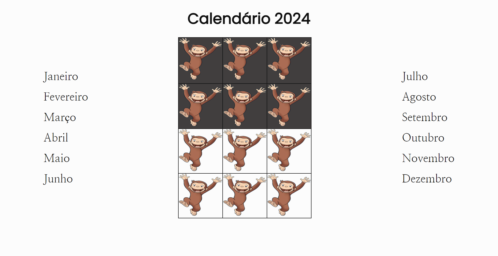

# Iframe-Calendar

> A project to study the Iframe functionality, where a calendar for the year 2024 was created using the iframe component to change months.

## Table of contents

-    [Overview](#overview)
     -    [The challenge](#the-challenge)
     -    [Links](#links)
     -    [Screenshot](#screenshot)
-    [My process](#my-process)
     -    [Built with](#built-with)

## Overview

### The challenge

Users should be able to:

-    See the images at a first glance
-    Being able to switch between all months of the year
-    Being able to see the days of the selected month
-    Be able to identify the days of the selected month and the adjacent ones
-    Being able to observe specific animations and colors in transitions

### Links

-    Live Site URL: https://iframe-calendar.netlify.app

### Screenshot

-    Desktop

     

## My process

### Built with

-    HTML
-    CSS
-    JAVASCRIPT

[⬆ Back to the top](#Iframe-Calendar) 
